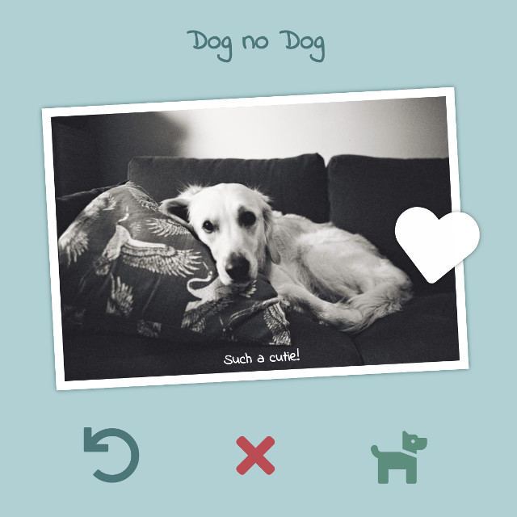

## Dog no Dog

<p align="center">
  
</p>

Dog no Dog is a sample application to showcase how to build a minimum viable product with serverless technologies on AWS.

With the Dog no Dog application, users can submit a picture and the backend should check if there is a dog in it. After this, the user has the possibility to leave a feedback if the picture contains a dog or not.

The standard frontend implementation uses a mock that will always returns that there is a dog in the picture.

This repository is comprised of two branches:

* __master__: The backend only contains helpers (Makefile, boilerplate code for your AWS Lambda functions) and it is up to you to implement the backend.
* __complete__: A complete implementation of both the frontend and backend for reference.

As this is meant as a challenge and hands-on workshop with limited help, a few hints are available below but you are encouraged to try things by yourself as much as possible.

If you are new to Serverless applications on AWS or are looking for a more guided workshop to learn about Serverless technologies, you should look at the [AWS Serverless Workshops](https://github.com/aws-samples/aws-serverless-workshops).

## How to get started

The project consist of a [Vue.js 2](https://vuejs.org/) frontend and boilerplate to create a serverless backend using [AWS SAM](https://docs.aws.amazon.com/serverless-application-model/latest/developerguide/what-is-sam.html).

To install the necessary libraries for Vue.js and get started, you will need to have NPM installed and run the following commands:

```bash
# From the root of this repository

# Install the Vue.js CLI
npm install -g @vue-cli

# Install packages for this project
npm install

# Run the Vue app locally
npm run serve
```

You can find the boilerplate for the serverless backend in the [backend folder](./backend/).

## Hints

<details>
<summary><strong>
What do I need to build on the backend? <small>(expand to see the answer)</small>
</strong></summary>

There is no formal API definition, but you can find all the API calls made by the frontend in the [api.js file](./src/backend/api.js) in the frontend.

</details>

<details>
<summary><strong>
Where can I configure the API endpoint in the frontend? <small>(expand to see the answer)</small>
</strong></summary>

The API endpoint value is held in the [.env.development](./.env.development) and [.env.production](./.env.production) files.

</details>

<details>
<summary><strong>
How can I deploy the frontend to AWS? <small>(expand to see the answer)</small>
</strong></summary>

You can leverage [AWS Amplify Console](https://aws.amazon.com/amplify/console/) to create a CI/CD pipeline for the frontend.

For this, you will need to initialise the frontend folder as a git repository and push it to a repository service provider supported by AWS Amplify Console.

You can find more details in the [Getting Started](https://docs.aws.amazon.com/amplify/latest/userguide/getting-started.html) section of the documentation.

</details>

<details>
<summary><strong>
How can I deploy the backend to AWS? <small>(expand to see the answer)</small>
</strong></summary>

For the backend, you will need to install the [AWS CLI](https://aws.amazon.com/cli/), the [AWS SAM CLI](https://docs.aws.amazon.com/serverless-application-model/latest/developerguide/serverless-sam-cli-install.html) and [Make](https://www.gnu.org/software/make/). The backend comes with a Makefile that contains the following targets:

```bash
# From the root of this repository

# Deploy log processing infrastructure to generate metrics
make -C backend log-processing

# Deploy the backend
# This runs the targets 'package', 'deploy' and 'endpoint' in sequence.
# Equivalent to 'make -C backend all'.
make -C backend

# Run the backend locally
# This will allow you to test the Amazon API Gateway Rest API and AWS Lambda
# functions locally. However, if you are using other resources (e.g. Amazon
# DynamoDB table, Amazon S3 bucket), you should deploy them to AWS first.
make -C backend local
```

This will deploy a 'dev' environment.

</details>

<details>
<summary><strong>
How can I deploy the backend locally? <small>(expand to see the answer)</small>
</strong></summary>

The [Makefile in the /backend/ folder](./backend/Makefile) contains a target named `local`. You can run this target to deploy your serverless application locally for debugging and testing.

See [sam local start-api](https://docs.aws.amazon.com/serverless-application-model/latest/developerguide/sam-cli-command-reference-sam-local-start-api.html) for more information about how this work.

</details>

<details>
<summary><strong>
How can I deploy the frontend and backend at the same time? <small>(expand to see the answer)</small>
</strong></summary>

Amplify Console will look for a file named `amplify.yml` in your repository. This file can contain instructions to deploy the backend and frontend, as well as [end-to-end testing instructions using Cypress](https://aws.amazon.com/blogs/mobile/run-end-to-end-cypress-tests-for-your-fullstack-ci-cd-deployment-with-amplify-console/).

</details>


## License Summary

This sample code is made available under the MIT-0 license. See the [LICENSE file](./LICENSE).
